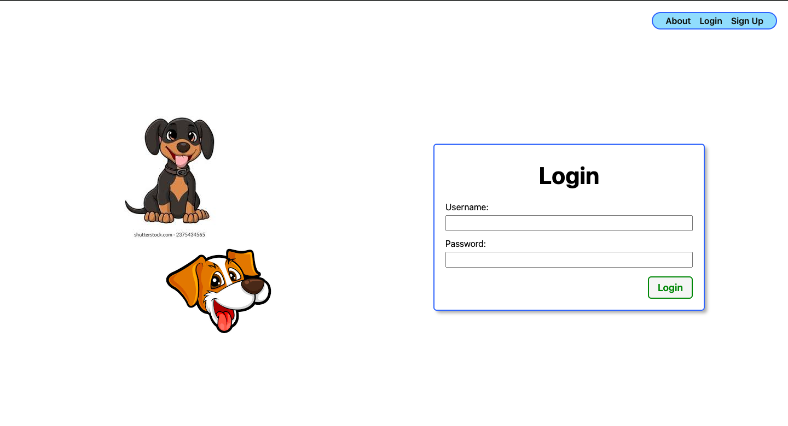
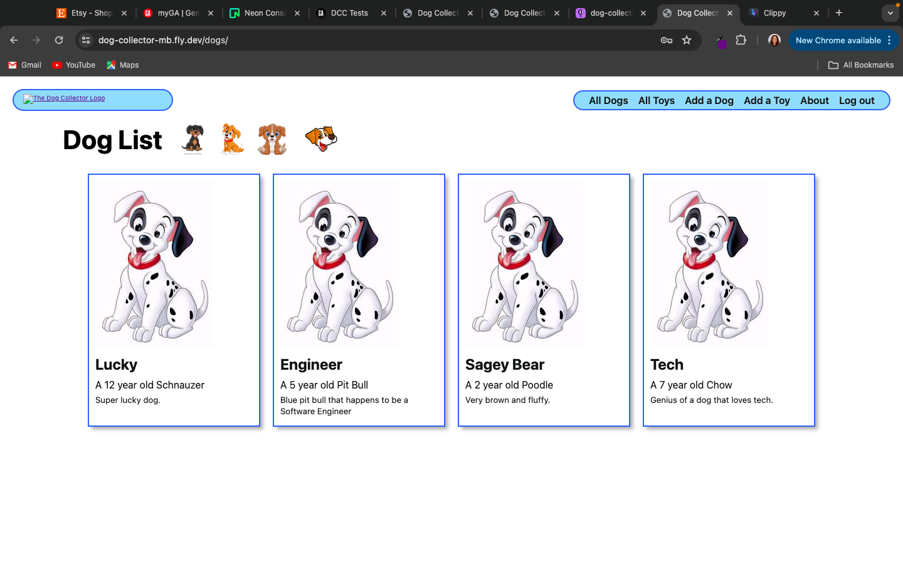
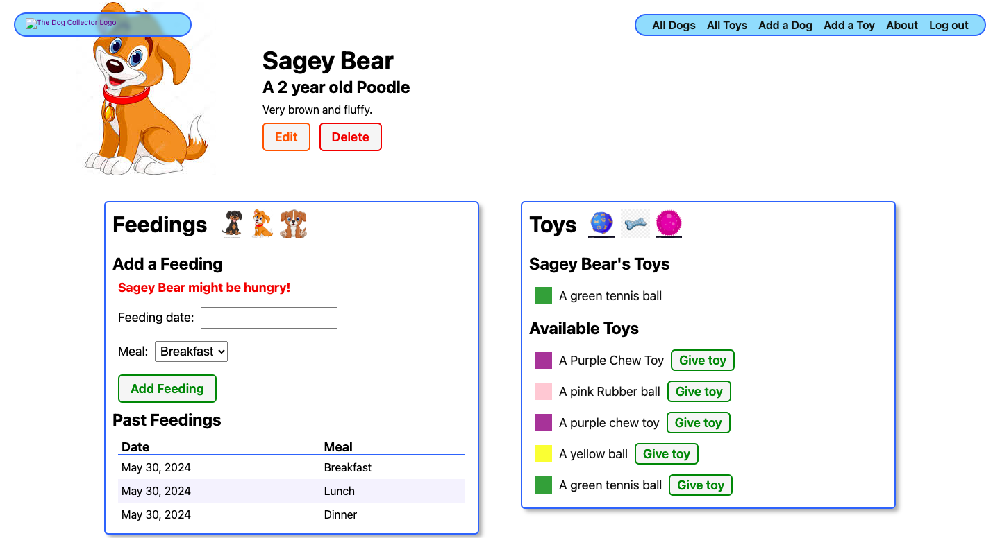

# Dog Collector

### Dog Collector:

### [Dog Collector App](https://dog-collector-mb.fly.dev/)
### [GitHub Repository](https://github.com/marieblakely/dogcollector.git)

### Description:

#####  Dog Collector is an app that allows you to track daily feedings for your puppy as well as use as a tool for reminders to give your puppy a toy. Using Dog Collector, you can add feedings days ahead to ensure a proper feeding schedule for your pup. You can add as many puppies allowing you to track feedings and toys for each of your pups; and you can add multiple toys as well. 

Technologies Used:

* HTML
* CSS
* Git
* GitHub
* Fly.io
* Python
* Django
* Docker
* Neon Console - Neon.tech

Attributes:
* [Cartoon Puppy Images](https://google.com/cartoon-puppy-images/)
* [Cartoon Puppy Images](https://www.shutterstock.com/search/cartoon-puppy)
* [Cartoon Dog Toy Images](https://google.com/cartoon-puppy-images/)

Icebox Items:
* AAU I would like to upload pictures of my puppy/puppies.
* AAU I would like to upload pictures of my puppy toys.

